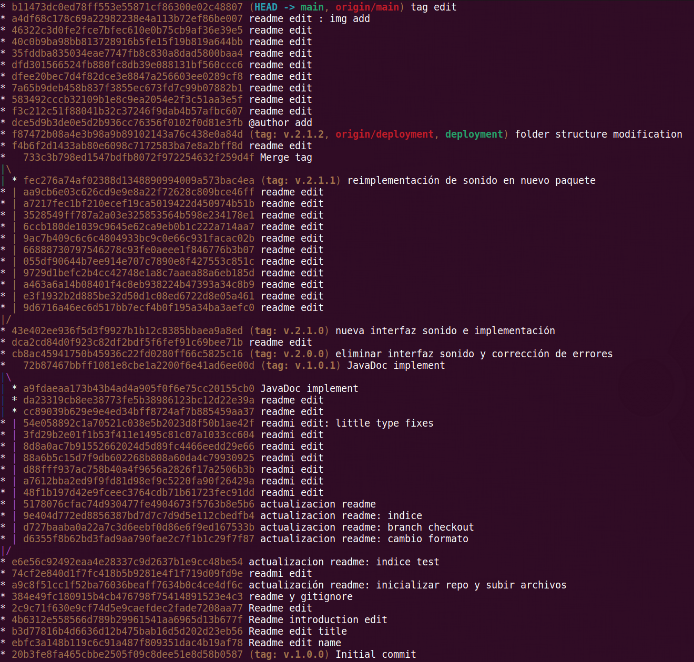

# **PRÁCTICA 4 - ENTORNOS DE DESARROLLO**

### Realizada por Josep Castell y Agustín Tudurí

---

<p style="font-size:14pt;font-weight:lighter">La Práctica 4 consiste en añadir la Práctica 3 a un nuevo repositorio en GitHub y aplicarle una serie de refactorizaciones, de forma que aprendamos a usar los diferentes comandos de Git para llevar a cabo un correcto control de versiones.</p>

---

## Índice

[**Inicializar repositorio y subir archivos**](#inicializar-repositorio-y-subir-archivos)

- [Inicializar repositorio](#inicializar-repositorio)
- [_Untracked_](#untracked-staged-y-commit), [_staged_](#staged-git-add) y [_commit_](#commit)
- [_Log_](#log)
- [Etiquetas (_tag_)](#etiquetas-tag)
- [_Push_](#push)
- [_Pull_](#pull)

[**Nuevas ramas y actualizaciones**](#nuevas-ramas-y-actualizaciones)

- [_Branch_](#branch)
- [Eliminar rama](#eliminar-rama)
- [_Checkout_](#checkout)
- [_Merge_](#merge)

[**Continuación de la práctica**](#continuación-de-la-práctica)

---

## Inicializar repositorio y subir archivos

### Inicializar repositorio

Para empezar debemos inicializar un nuevo repositorio en nuestra carpeta local dónde se encuentra la Práctica 3.
Para ello nos situamos en el directorio mencionado y usamos el comando:

```
git init
```

A continuación podemos añadir los archivos **README.md** y **.gitignore**.
Creamos los archivos dentro del directorio usando, por ejemplo:

```
touch README.md
touch .gitignore
```

> El archivo **README.md** nos servirá para editar el presente texto en formato Markdown; donde iremos comentando el proceso que hemos seguido. <br />
> El archivo **.gitignore** es un archivo en el que añadiremos los nombres de los archivos que no queremos que sean rastreados por Git. En nuestro caso, hemos añadido el archivo en formato PDF de la Práctica 3, ya que no tiene relevancia en el código.

El siguiente paso es iniciar el repositorio remoto. Para llevar a cabo este paso nos dirigimos a la página web de [GitHub](https://github.com) y creamos un nuevo repositorio, el cual hemos llamado 'ed_practica3' ya que contendrá el código de la Práctica 3.

Una vez hemos creado el nuevo repositorio debemos añadirlo como origen remoto a nuestro repositorio local. Esto lo conseguimos con el comando:

```
git remote add origin https://github.com/josep-castell-colom/ed_practica3.git
```

Ahora que tenemos vinculado nuestro repositorio local con el repositorio remoto ya estamos listos para subir los archivos.

### _Untracked_, _staged_ y _commit_

En este punto es interesante conocer los tres estadios por los que pasarán nuestros archivos antes de ser subidos al repositorio remoto. Podemos ir comprobando el estado de los archivos con el comando:

```
git status
```

Usando este comando podemos ver en qué estado se encuentran nuestros archivos:

1. En primer lugar, los archivos que hayan sido modificados se mostraran de color rojo en el apartado de archivos sin seguimiento(_untracked_).

2. El segundo estado es la fase _stage_. En este punto los archivos se muestran de color verde y están preparados para el commit.

3. La tercera fase es la fase de _commit_. Después de hacer _commit_, el comando `git status` no mostrará los archivos, sinó que nos informará del estado de nuestro árbol de trabajo respecto al remoto; si está actualizado o no.

#### _Staged_ (`git add`)

Para subir nuestros archivos, primeramente debemos añadirlos al índice, es decir, incluirlos en el área de _stage_. Esto lo logramos con el comando:

```
git add .
```

> Aquí el punto (.) simboliza todos los archivos del directorio (sin incluir los que hemos añadido a _.gitignore_). También podríamos añadir archivos en concreto cambiando el punto por el nombre del archivo; en ese caso el comando sería, por ejemplo:
>
> ```
> git add Persona.java
> ```

Ahora que tenemos los archivos en _stage_ podemos hacer el primer **commit**.

#### _Commit_

Cada _commit_ que hacemos es un punto concreto de nuestro proyecto en el que se guarda una especie de instantánea a la que podemos regresar en un futuro, ver los cambios que se llevaron a cabo e incluso saber quién los hizo y por qué.

> Para facilitar ésta información es recomendable incluir un pequeño mensaje en cada _commit_ explicando breve y concisamente los cambios que hemos hecho y por qué.

Para hacer un commit se puede usar el siguiente comando:

```
git commit
```

el cual nos abrirá un editor de texto donde aparecen los archivos que se han modificado y donde debemos incluir el mensaje explicativo, guardar el archivo y salir.

También podemos hacer uso de la opción `-m` para atajar el paso del editor. De modo que el comando quedaría así:

```
git commit -m '<mensaje_explicativo>'
```

Donde \<mensaje_explicativo\> sería la descripción, sin incluir los símbolos menor que (<) ni mayor que (>).

> También es posible realizar los pasos de _stage_ y _commit_ en uno sólo usando la opción `-a` del comando _commit_. De este modo el comando quedaría así:
>
> ```
> git commit -a -m '<mensaje_explicativo>'
> ```
>
> En este caso sólo se incluirían los archivos modificados o suprimidos, pero no los nuevos, es decir, la opción `-a` añade al _commit_ los archivos que ya estan siendo seguidos por Git, pero no los recién agregados.
> Aunque esta opción existe, no es muy recomendable ya que es más fácil añadir cambios no deseados al proyecto.

#### _Log_

Como hemos comentado al inicio de la sección, cada _commit_ realiza una instantánea de los archivos en ese momento concreto. Para ver el historial de _commits_ podemos usar el comando:

```
git log
```

que nos mostrará el _hash_ del _commit_, la etiqueta (si dispone de una), el nombre del autor, la fecha y el mensaje que hemos incluido al realizar el _commit_.

> Si no necesitamos tanta información y queremos ver el historial de forma resumida podemos usar uno de los siguientes comandos:
>
> ```
> git log --oneline
> ---
> git log --pretty=oneline
> ```

### Etiquetas (_tag_)

Llegados a éste punto ya podemos subir los archivos al repositorio remoto, sin embargo, vamos a realizar un pequeño paso antes y éste es añadir la etiqueta de versionado (_tag_) siguiendo el estándar de [Versionado Semántico 2.0.0](https://semver.org/lang/es/).<br />
Es bueno conocer que hay dos tipos de etiquetas: la etiqueta ligera (_lightweight_) y la etiqueta anotada (_annotated_). La primera nos permite crear una etiqueta rápida, simplemente incluyendo su nombre:

```
git tag v1.0
```

La etiqueta anotada es un objeto que contiene, entre otras cosas, su nombre, el nombre del autor, la fecha y la descripción. Es recomendable usar las etiquetas anotadas para un mejor seguimiento del proyecto.
La sintaxis para este tipo de etiquetas es:

```
git tag -a v1.0 -m 'Versión 1.0 del proyecto'
```

Las etiquetas hacen referencia a un _commit_ en concreto por lo que si ejecutamos alguno de los dos comandos anteriores se aplicará la etiqueta al _head_, es decir, al _commit_ más reciente; a la cabeza del proyecto.
Si necesitamos añadir una etiqueta a un _commit_ anterior tendremos que buscar su _hash_ con el comando visto anteriormente [`git log`](#log) e incluirlo después del comando anterior:

```
git tag -a v1.0 -m '<mensaje_explicativo> <commit_hash>'
```

Las etiquetas necesitan un comando adicional para ser actualizadas en el repositorio remoto. Lo veremos en el siguiente capítulo. ¹

### _Push_

Una vez hecho el _commit_ y añadida la etiqueta ya sólo nos falta subir los archivos. Para ello usaremos el comando:

```
git push -u origin main
```

En este comando, _origin_ se refiere al repositorio remoto y _main_ se refiere a la rama local que queremos subir.
La opción `-u` nos sirve para añadir el _upstream_ (seguimiento remoto) de cada rama que ha sido subida con éxito. De ésta forma podemos realizar `git push` y `git pull` sin necesidad de añadir cada vez los parámetros de repositorio remoto y rama local.

> ¹ Como hemos mencionado en el capítulo anterior las etiquetas necesitan un comando extra para que queden reflejadas en el repositorio remoto, ya que con `git push`, por defecto, no se incluyen. Para ello debemos introducir:
>
> ```
> git push origin <nombre_etiqueta>
> ```
>
> para incluir una etiqueta en concreto, o:
>
> ```
> git push origin --tags
> ```
>
> para incluir todas las etiquetas creadas localmente.

### Pull

Así como `git push` nos sirve para actualizar el repositorio remoto con el repositorio local, para realizar la acción inversa e incluir en el repositorio local los cambios efectuados en el remoto usaremos el comando:

```
git pull
```

> Si hemos usado el comando `git push` con la opción `-u`, el comando anterior será suficiente; si no es así, debemos añadir el repositorio remoto:
>
> ```
> git pull origin
> ```

Cabe destacar que la acción _pull_ puede desencadenar conflictos si se han editado las mismas líneas de código. En este caso se nos enseñarán las diferencias y se nos pedirá que elijamos la versión definitiva para que prevalezca sobre la otra.

## Nuevas ramas y actualizaciones

### _Branch_

En relación a las ramas (_branch_) hay una serie de comandos que debemos conocer.
En primer lugar:

```
git branch
```

Si ejecutamos este comando nos va a listar las diferentes ramas con las que cuenta nuestro proyecto. En este momento no hemos creado ninguna de modo que sólo aparecería la rama _main_.

Si a este comando le añadimos una cadena de caracteres creará una nueva rama cuyo nombre será la cadena elegida. En nuestro caso crearemos una nueva rama para el desarrollo de la aplicación:

```
git branch dev
```

Cabe señalar que con lo anterior hemos creado la rama en nuestro repositorio local pero todavía no está incluida en el repositorio remoto. Para ello debemos introducir el comando:

```
git push -u origin <rama>
```

#### Eliminar rama

Si en un futuro lo deseamos, podemos eliminar las ramas. Con la opción `-d` del comando `git branch` podemos eliminar las ramas de nuestro repositorio local; pero no serán eliminadas del repositorio remoto.

```
git branch -d <branch>
```

Si también queremos eliminar la rama del repositorio remoto no usaremos `git branch` sinó `git push` con la opción `--delete`; indicando el repositorio remoto y la rama a eliminar.

```
git push origin --delete <branch>
```

### _Checkout_

Una vez creada usaremos el siguiente comando para movernos entre las diferentes ramas:

```
git checkout <rama>
```

En este momento los cambios que efectuemos en nuestro código quedaran registrados en la nueva rama, sin modificar la rama principal (_main_).

Si queremos actualizar nuestra rama en el repositorio remoto debemos repetir los pasos [_stage_ y _commit_](#untracked-staged-y-commit) después de haber realizado los cambios pertinentes.

### _Merge_

Al tener una nueva versión estable en la rama de desarrollo es hora de fusionarla con la rama principal.

Para llevar esto a cabo debemos situarnos en la rama principal (usado `git checkout main`) y desde esta rama llamar al comando:

```
git merge dev
```

> En caso de que dispusiéramos de múltiples ramas y debamos fusionar la rama de desarrollo con una rama diferente a la principal, simplemente nos situaremos en la rama que deba recibir los cambios y desde allí haremos el _merge_ con la rama de desarrollo.

Éste es un buen momento para [añadir una nueva etiqueta de versionado](#etiquetas-tag) ya que fusionamos una nueva versión estable.<br />
Es interesante saber que es posible fusionar una rama con una versión en concreto. Para conseguirlo, simplemente nos situamos en la rama que deseamos que sea modificada (al igual que en el ejemplo anterior) y usamos el mismo comando seguido del nombre de la etiqueta:

```
git merge <nombre_etiqueta>
```

En cualquier caso, después del _merge_ debemos incluir los archivos nuevos con `git add .`, hacer _commit_ y _push_.

> También recordar que para [actualizar la etiqueta en el repositorio](#push) remoto debemos ejecutar
>
> ```
> git push origin <nombre_etiqueta>
> ```

## Continuación de la práctica

De ahora en adelante no veremos más comandos nuevos, sin embargo, seguiremos comentando los cambios que hemos llevado a cabo para cumplir con los objetivos de la práctica; los cuales seran visibles desde [este repositorio](https://github.com/josep-castell-colom/ed_practica3.git).

Lo primero que hemos hecho ha sido usar la rama _dev_ para actualizar los comentarios al formato JavaDoc. Una vez ha estado listo hemos fusionado la rama _main_ con la rama _dev_ y le hemos dado la etiqueta de versión 1.0.1, pues no incluía ninguna funcionalidad nueva.

En segundo lugar, hemos eliminado la interfaz `Sonido` directamente de la rama _main_ y hemos eliminado los métodos `sonido()` de las clases donde estaba implementado.
Una vez corregidos los errores y teniendo una versión estable, hemos realizado el _commit_ y el _push_ y le hemos asignado la etiqueta de versión 2.0.0, pues el cambio que hemos realizado no era compatible con la anterior versión.

Lo siguiente ha sido crear una nueva rama a la que hemos llamado _deployment_ y hemos añadido de nuevo la interfaz Sonido. Hemos implementado el método sonido en las clases Motor y Mascota y, por herencia, en las clases Gato y Perro.  
Una vez más, al finalizar las modificaciones, le hemos dado la etiqueta de v.2.1.0; pues tiene una nueva funcionalidad pero no es incompatible con la anterior versión 2.0.0.

El siguiente paso ha sido, continuando en la rama _deployment_, hemos refactorizado el código moviendo la interfaz Sonido a un nuevo paquete.
Seguidamente, hemos aprovechado para reorganizar la estructura de directorios siguiendo (en cierta medida) el estándar [Maven](https://maven.apache.org/guides/introduction/introduction-to-the-standard-directory-layout.html).
Debido a que estas dos últimas refactorizaciones no influyen en el funcionamiento les hemos asignado las versiones 2.1.1 y  2.1.2 respectivamente.

## Resumen y comando extra

Debido a que en GitHub/Insights/Network sólo se muestran los últimos _commits_ no es posible visualizar todo el árbol del proyecto con las distintas ramas creadas, por lo que se adjunta a continuación una captura del historial de Git; que se consigue combinando dos opciones del comando `git log`. La opción `--graph` nos muestra el historial de _commits_ al cual se añade, a su izquierda, el árbol con sus distintas ramas. Si a ésto le añadimos la opción `--pretty=oneline` conseguimos ver el historial en formato reducido. Por lo que el comando queda de la siguiente forma:

```
git log --graph --pretty=oneline
```



En el historial podemos ver todo el proceso, desde el _commit_ inicial, las diferentes ramas con sus _commits_ y el punto
en el que se fusionan con la rama principal.

- Para empezar, se ha hecho el commit inicial con la etiqueta de versión 1.0.0 y se han realizado varios _commits_ en la rama principal sin influir en el código del programa.
- Después se ha creado la rama `dev`(color lila) donde se ha implementado el formato JavaDoc, y se ha unido a la rama principal con la etiqueta v.1.0.1.
- Seguidamente, en la rama principal se ha eliminado la interfaz `Sonido` y se le ha dado la versión 2.0.0.
- El siguiente paso ha sido añadir de nuevo la interfaz, directamente en la rama principal, e implementar el método `sonido()` en las clases correspondientes. A ésta versión se la ha etiquetado como 2.1.0.
- A continuación, se ha creado la rama `deployment` (color naranja) dónde se ha movido la interfaz `Sonido` a un nuevo paquete (esta versión es la 2.1.1) y se ha añadido a la rama principal.
- Por último se ha modificado la estructura de directorios directamente en la rama principal (v.2.1.2).
